# ecg_c1_moe

Collected from `/leonardo_scratch/fast/IscrB_WearUsFM/yanlchen/runs/pretrain_ecg_c1_moe` by `scripts/collect_pretrain_run.sh`.

57 epoch(s) with validation; last epoch 56, step 57000.

| selection | epoch | val total | val spec | val raw | spec r | raw r |
|---|---|---|---|---|---|---|
| best total (best.pth) | 32 | 0.18271 | 0.25616 | 0.10925 | 0.851 | 0.845 |
| best spec | 18 | 0.18379 | 0.25514 | 0.11245 | 0.852 | 0.843 |
| best raw | 36 | 0.18324 | 0.25736 | 0.10912 | 0.850 | 0.845 |
| last | 56 | 0.18767 | 0.26424 | 0.11109 | 0.847 | 0.840 |

Per route and per dataset: `progress_by_route.txt`, `progress_by_dataset.txt`. What each figure was drawn from: `figure_metadata/`.

## 10_dual_objective ([PDF](figures/10_dual_objective.pdf))

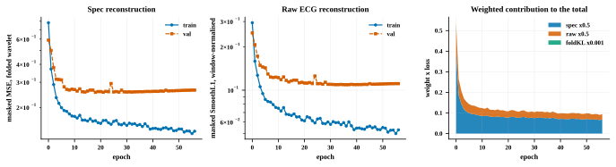

## 11_masked_vs_visible_error ([PDF](figures/11_masked_vs_visible_error.pdf))

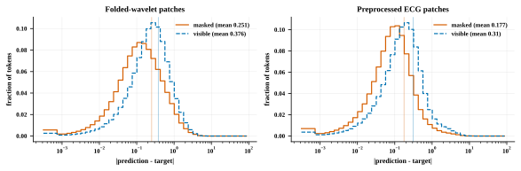

## 12_gradient_flow ([PDF](figures/12_gradient_flow.pdf))

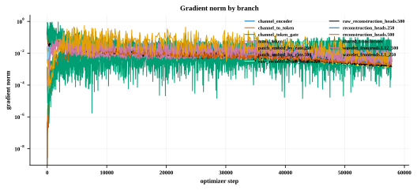

## 13_route_cost ([PDF](figures/13_route_cost.pdf))

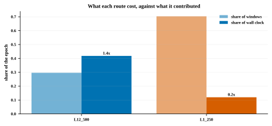

## 14_raw_waveform_reconstruction ([PDF](figures/14_raw_waveform_reconstruction.pdf))

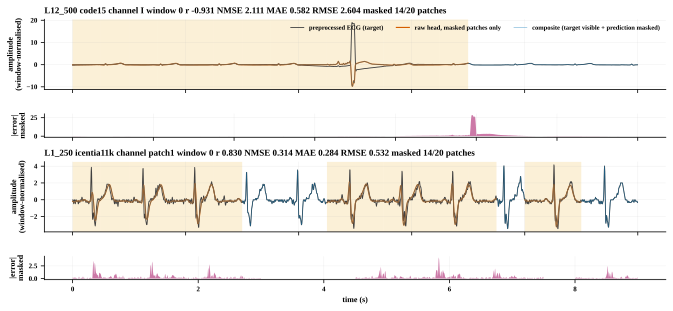

## 14_raw_waveform_reconstruction_w01 ([PDF](figures/14_raw_waveform_reconstruction_w01.pdf))

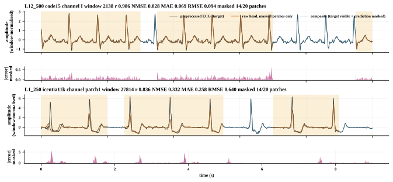

## 14_raw_waveform_reconstruction_w02 ([PDF](figures/14_raw_waveform_reconstruction_w02.pdf))

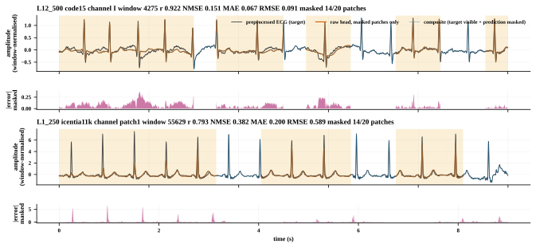

## 14_raw_waveform_reconstruction_w03 ([PDF](figures/14_raw_waveform_reconstruction_w03.pdf))

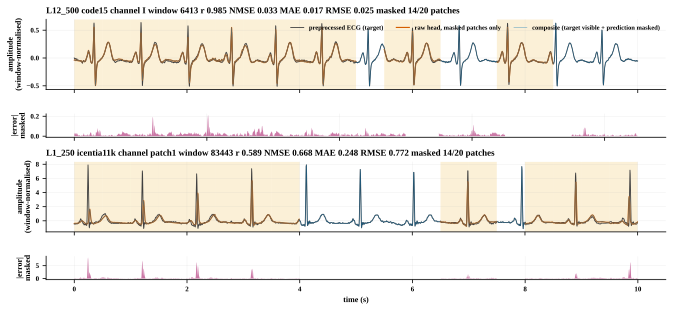

## fig_channel_embedding ([PDF](figures/fig_channel_embedding.pdf))

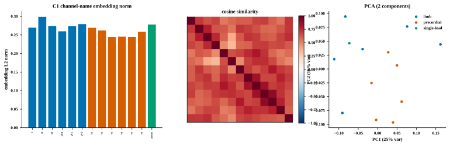

## fig_dataset_routes ([PDF](figures/fig_dataset_routes.pdf))

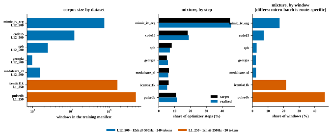

## fig_mask_examples_by_dataset ([PDF](figures/fig_mask_examples_by_dataset.pdf))

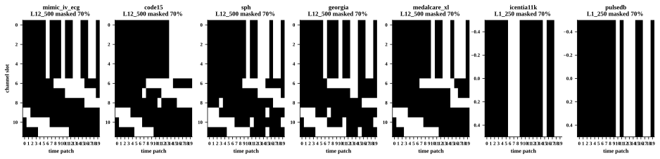

## fig_mask_reconstruction ([PDF](figures/fig_mask_reconstruction.pdf))

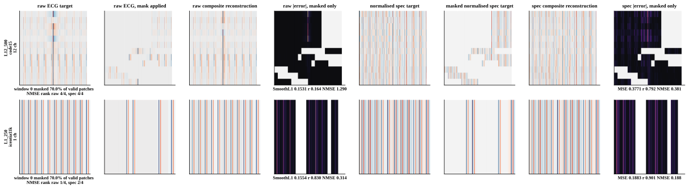

## fig_mask_reconstruction_w01 ([PDF](figures/fig_mask_reconstruction_w01.pdf))

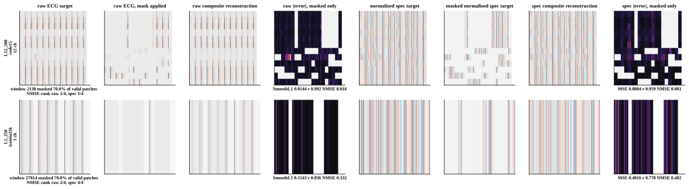

## fig_mask_reconstruction_w02 ([PDF](figures/fig_mask_reconstruction_w02.pdf))

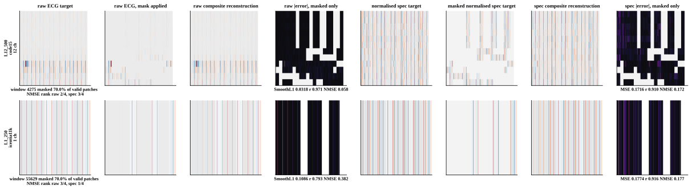

## fig_mask_reconstruction_w03 ([PDF](figures/fig_mask_reconstruction_w03.pdf))

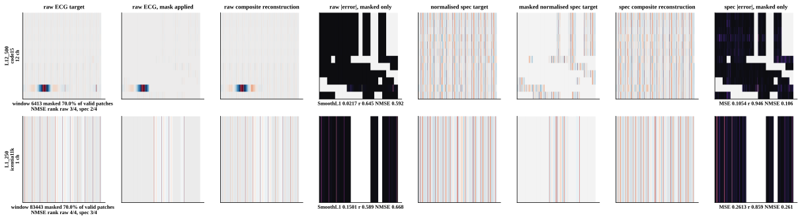

## fig_mask_statistics ([PDF](figures/fig_mask_statistics.pdf))

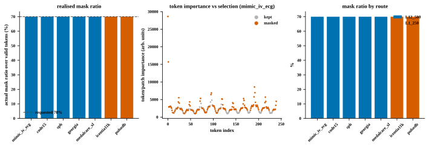

## fig_pretraining_convergence ([PDF](figures/fig_pretraining_convergence.pdf))

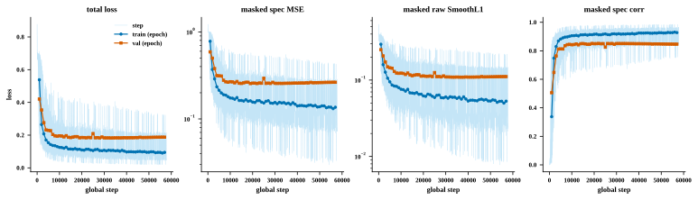

## fig_route_convergence ([PDF](figures/fig_route_convergence.pdf))

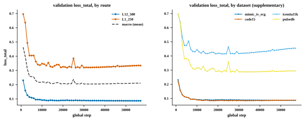

## fig_scale_fold_weights ([PDF](figures/fig_scale_fold_weights.pdf))

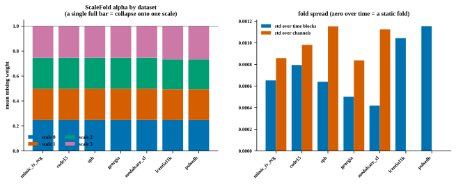

## fig_wavelet_frequency_response ([PDF](figures/fig_wavelet_frequency_response.pdf))

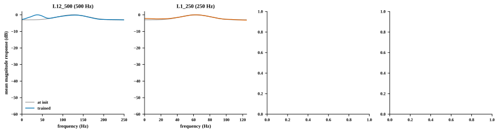
